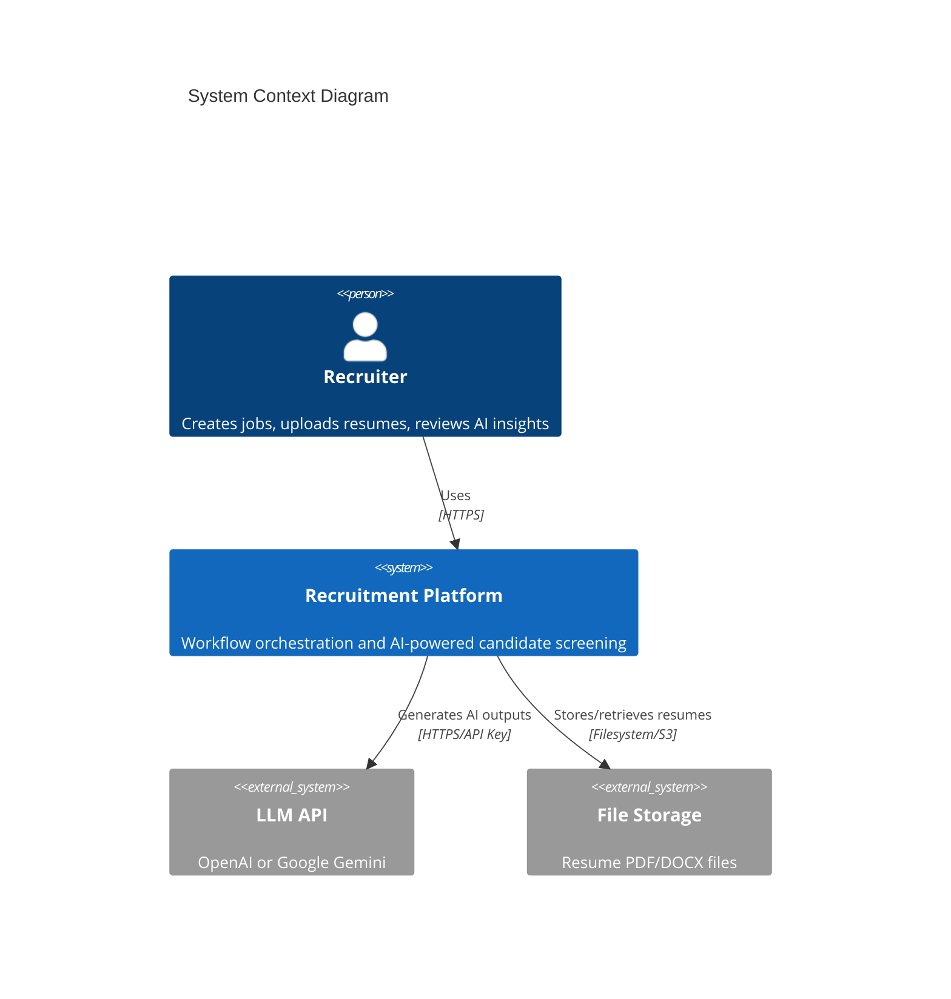
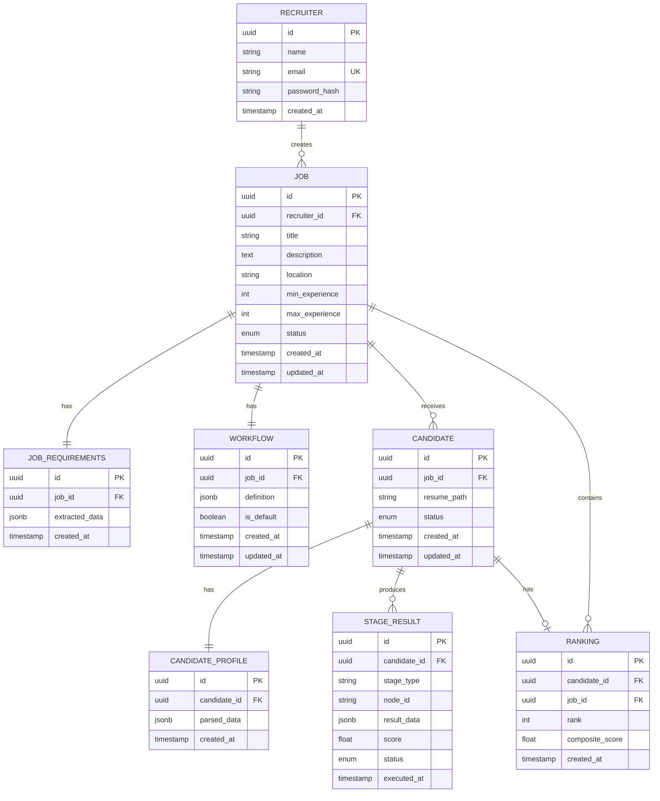
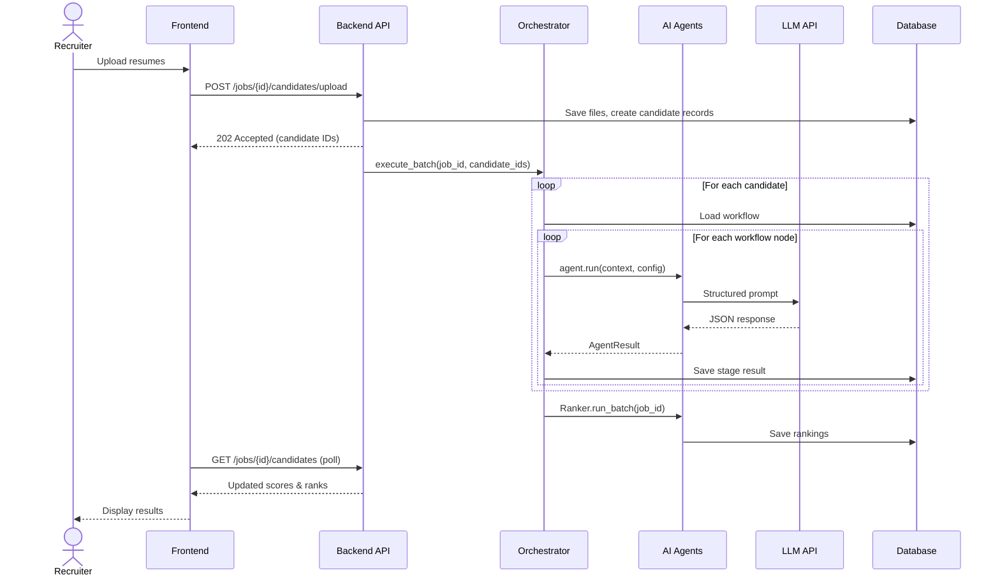
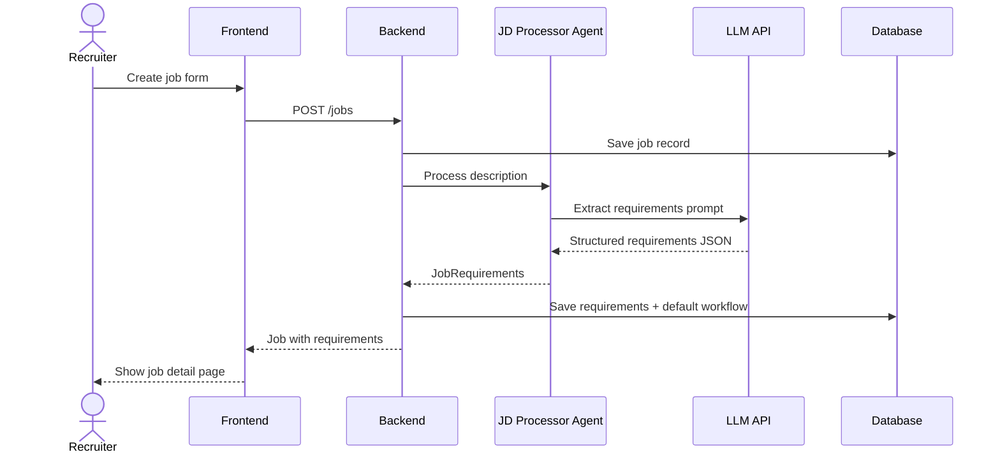

# System Architecture Document

## AI-Based Recruitment Workflow Orchestration Platform Using Agentic AI

**Version:** 1.0  
**Date:** September 2026  
**Project Type:** MCA Final Year Project

---

## Table of Contents

1. [Architecture Overview](#1-architecture-overview)
2. [Technology Stack](#2-technology-stack)
3. [System Context](#3-system-context)
4. [Layered Architecture](#4-layered-architecture)
5. [Component Design](#5-component-design)
6. [AI Agent Architecture](#6-ai-agent-architecture)
7. [Workflow Orchestration](#7-workflow-orchestration)
8. [Data Architecture](#8-data-architecture)
9. [API Design](#9-api-design)
10. [Frontend Architecture](#10-frontend-architecture)
11. [Security Architecture](#11-security-architecture)
12. [Deployment Architecture](#12-deployment-architecture)
13. [Data Flow Diagrams](#13-data-flow-diagrams)
14. [Sequence Diagrams](#14-sequence-diagrams)
15. [Error Handling & Resilience](#15-error-handling--resilience)
16. [Extensibility Guidelines](#16-extensibility-guidelines)

---


## 1. Architecture Overview

The platform follows a **three-tier architecture** with a dedicated **agentic AI layer** orchestrated by a central workflow engine.

```
┌─────────────────────────────────────────────────────────────────┐
│                     PRESENTATION TIER                           │
│              React SPA (Dashboard + Workflow Builder)           │
└────────────────────────────┬────────────────────────────────────┘
                             │ REST API (HTTPS/JSON)
┌────────────────────────────▼────────────────────────────────────┐
│                      APPLICATION TIER                           │
│  ┌──────────┐  ┌──────────────┐  ┌──────────────────────────┐  │
│  │   Auth   │  │  Job/Candidate│  │  Workflow Orchestrator  │  │
│  │ Service  │  │   Services    │  │        Engine           │  │
│  └──────────┘  └──────────────┘  └────────────┬─────────────┘  │
└───────────────────────────────────────────────┼─────────────────┘
                             │                  │
┌────────────────────────────▼──────────────────▼─────────────────┐
│                        AGENT TIER                                 │
│  ┌────────┐ ┌─────────┐ ┌────────┐ ┌──────────┐ ┌────────────┐  │
│  │   JD   │ │ Resume  │ │ Screen │ │  Skill   │ │ Evaluation │  │
│  │Processor│ │ Parser  │ │ Agent  │ │  Matcher │ │   Agent    │  │
│  └────────┘ └─────────┘ └────────┘ └──────────┘ └────────────┘  │
│  ┌────────┐ ┌──────────┐                                         │
│  │ Ranker │ │ Interview│         ──►  LLM API (OpenAI/Gemini)   │
│  └────────┘ └──────────┘                                         │
└───────────────────────────────────────────────────────────────────┘
                             │
┌────────────────────────────▼────────────────────────────────────┐
│                        DATA TIER                                │
│         PostgreSQL          │        File Storage (Resumes)     │
└─────────────────────────────────────────────────────────────────┘
```


### 1.1 Architectural Principles


| Principle                     | Application                                                            |
| ----------------------------- | ---------------------------------------------------------------------- |
| **Separation of Concerns**    | UI, business logic, agents, and data are isolated                      |
| **Agent Independence**        | Each AI agent is a self-contained module with a standard interface     |
| **Workflow-Driven Execution** | Processing order is defined by configurable graphs, not hardcoded      |
| **Structured AI Output**      | All LLM responses validated against Pydantic schemas                   |
| **Fail-Safe Pipeline**        | Stage failures preserve prior results; pipeline can resume             |
| **API-First**                 | Frontend consumes REST APIs; enables future mobile/integration clients |


---


## 2. Technology Stack


### 2.1 Frontend


| Component       | Technology                          | Version |
| --------------- | ----------------------------------- | ------- |
| Framework       | React                               | 18.x    |
| Language        | TypeScript                          | 5.x     |
| Build Tool      | Vite                                | 5.x     |
| UI Library      | MUI (Material UI)                   | 6.x     |
| Styling         | MUI `sx` prop + Emotion             | Latest  |
| Icons           | @mui/icons-material                 | Latest  |
| Data Tables     | MUI X Data Grid                     | 7.x     |
| Workflow Canvas | React Flow                          | 11.x    |
| HTTP Client     | Axios / TanStack Query              | Latest  |
| Routing         | React Router                        | 6.x     |


### 2.2 Backend


| Component       | Technology                    | Version |
| --------------- | ----------------------------- | ------- |
| Framework       | FastAPI                       | 0.100+  |
| Language        | Python                        | 3.11+   |
| ORM             | SQLAlchemy                    | 2.x     |
| Migrations      | Alembic                       | 1.x     |
| Validation      | Pydantic                      | 2.x     |
| Auth            | python-jose + passlib/bcrypt  | Latest  |
| PDF Parsing     | PyMuPDF (fitz)                | Latest  |
| DOCX Parsing    | python-docx                   | Latest  |
| Task Processing | FastAPI BackgroundTasks (MVP) | —       |
| Optional Queue  | Celery + Redis                | —       |


### 2.3 Infrastructure


| Component        | Technology                               |
| ---------------- | ---------------------------------------- |
| Database         | PostgreSQL 15+                           |
| Containerization | Docker + Docker Compose                  |
| File Storage     | Local filesystem (dev), MinIO/S3 (prod)  |
| LLM Provider     | OpenAI GPT-4o-mini / Google Gemini Flash |


---


## 3. System Context




### 3.1 External Actors

- **Recruiter** — primary user interacting via web browser
- **LLM Provider** — external AI service for all agent intelligence
- **File Storage** — persistent store for uploaded resume documents

---


## 4. Layered Architecture


### 4.1 Presentation Layer

Responsible for user interaction:

- Authentication screens
- Job management CRUD
- Visual workflow builder (React Flow)
- Candidate dashboard and detail views
- Real-time status polling for pipeline progress


### 4.2 Application Layer

Business logic and coordination:

- **Routers/Controllers** — HTTP endpoint handlers
- **Services** — job, candidate, workflow business logic
- **Orchestrator Engine** — executes agent pipelines
- **Auth Middleware** — JWT validation and recruiter context


### 4.3 Agent Layer

Specialized AI modules:

- Each agent encapsulates prompt engineering, LLM invocation, and output parsing
- Agents are stateless; all context passed via orchestrator
- Agent registry maps workflow node types to agent implementations


### 4.4 Data Layer

Persistence:

- PostgreSQL for relational data
- Filesystem/S3 for binary resume files
- Alembic for schema versioning

---


## 5. Component Design


### 5.1 Backend Module Structure

```
backend/
├── app/
│   ├── main.py                 # FastAPI app entry, CORS, middleware
│   ├── config.py               # Settings from environment
│   ├── database.py             # DB session, engine
│   │
│   ├── models/                 # SQLAlchemy ORM models
│   │   ├── recruiter.py
│   │   ├── job.py
│   │   ├── workflow.py
│   │   ├── candidate.py
│   │   └── stage_result.py
│   │
│   ├── schemas/                # Pydantic request/response schemas
│   │   ├── auth.py
│   │   ├── job.py
│   │   ├── workflow.py
│   │   ├── candidate.py
│   │   └── agents/             # Agent output schemas
│   │
│   ├── routers/                # API route handlers
│   │   ├── auth.py
│   │   ├── jobs.py
│   │   ├── workflows.py
│   │   ├── candidates.py
│   │   └── dashboard.py
│   │
│   ├── services/               # Business logic
│   │   ├── auth_service.py
│   │   ├── job_service.py
│   │   ├── candidate_service.py
│   │   └── workflow_service.py
│   │
│   ├── agents/                 # AI agent implementations
│   │   ├── base.py             # BaseAgent, AgentResult
│   │   ├── registry.py         # Agent type → class mapping
│   │   ├── jd_processor.py
│   │   ├── resume_parser.py
│   │   ├── screener.py
│   │   ├── skill_matcher.py
│   │   ├── evaluator.py
│   │   ├── ranker.py
│   │   └── interview.py
│   │
│   ├── orchestrator/
│   │   ├── engine.py           # Main orchestration logic
│   │   ├── graph.py            # Topological sort, validation
│   │   └── context.py          # Pipeline context management
│   │
│   └── utils/
│       ├── llm.py              # LLM client wrapper
│       ├── file_parser.py      # PDF/DOCX text extraction
│       └── security.py         # JWT, password hashing
│
├── alembic/                    # Database migrations
├── requirements.txt
└── Dockerfile
```


### 5.2 Frontend Module Structure

```
frontend/
├── src/
│   ├── main.tsx
│   ├── App.tsx
│   │
│   ├── pages/
│   │   ├── LoginPage.tsx
│   │   ├── RegisterPage.tsx
│   │   ├── DashboardPage.tsx
│   │   ├── JobsPage.tsx
│   │   ├── JobDetailPage.tsx
│   │   ├── WorkflowBuilderPage.tsx
│   │   ├── CandidatesPage.tsx
│   │   └── CandidateDetailPage.tsx
│   │
│   ├── components/
│   │   ├── layout/             # AppLayout, AppBar, Drawer, MainContent
│   │   ├── jobs/               # JobForm, JobCard, JobList
│   │   ├── workflow/           # WorkflowCanvas, NodePalette, NodeConfig
│   │   └── candidates/         # CandidateTable, ScoreBadge, StageProgress
│   │
│   ├── theme/
│   │   ├── theme.ts            # MUI theme (palette, typography, components)
│   │   └── ThemeProvider.tsx   # ThemeProvider wrapper
│   │
│   ├── hooks/                  # useAuth, useJobs, useCandidates
│   ├── api/                    # API client functions
│   ├── types/                  # TypeScript interfaces
│   └── lib/                    # Utilities, constants
│
├── package.json
└── Dockerfile
```

---


## 6. AI Agent Architecture


### 6.1 Agent Interface

All agents implement a common abstract base class:

```python
from abc import ABC, abstractmethod
from pydantic import BaseModel

class AgentResult(BaseModel):
    success: bool
    data: dict
    score: float | None = None
    should_continue: bool = True
    error: str | None = None

class BaseAgent(ABC):
    agent_type: str

    @abstractmethod
    async def run(self, context: dict, config: dict) -> AgentResult:
        """Execute agent logic with pipeline context and node config."""
        pass
```


### 6.2 Agent Registry

```python
AGENT_REGISTRY = {
    "parse": ResumeParserAgent,
    "screen": ScreeningAgent,
    "skill_match": SkillMatchingAgent,
    "evaluate": EvaluationAgent,
    "rank": RankingAgent,
    "interview": InterviewAgent,
    "jd_process": JDProcessorAgent,
}
```


### 6.3 Agent Catalog


| Agent         | Type Key      | Input Context                  | Output Schema        | Score Range |
| ------------- | ------------- | ------------------------------ | -------------------- | ----------- |
| JD Processor  | `jd_process`  | Raw JD text                    | `JobRequirements`    | N/A         |
| Resume Parser | `parse`       | Resume file path               | `CandidateProfile`   | N/A         |
| Screening     | `screen`      | Profile + Requirements         | `ScreeningResult`    | 0–100       |
| Skill Matcher | `skill_match` | Profile + Requirements         | `SkillMatchResult`   | 0–100       |
| Evaluator     | `evaluate`    | Profile + Match + Requirements | `EvaluationResult`   | 0–100       |
| Ranker        | `rank`        | All candidate scores (batch)   | `RankingResult`      | N/A         |
| Interview     | `interview`   | Profile + Gaps + Requirements  | `InterviewQuestions` | N/A         |


### 6.4 LLM Integration Pattern

```python
async def call_llm_structured(
    system_prompt: str,
    user_prompt: str,
    output_schema: type[BaseModel],
    max_retries: int = 2
) -> BaseModel:
    """
    1. Send prompt to LLM with JSON schema instruction
    2. Parse response into Pydantic model
    3. Retry on validation failure with error feedback
    """
```

**Prompt structure per agent:**

- **System prompt** — role definition, output rules, schema description
- **User prompt** — job context + candidate context + specific task
- **Response** — validated JSON matching Pydantic schema


### 6.5 Agent Output Schemas (Examples)

**ScreeningResult:**

```json
{
  "relevant": true,
  "relevance_score": 78,
  "reason": "Candidate has 3 years Python experience matching job requirements",
  "key_qualifications": ["Python", "FastAPI", "PostgreSQL"],
  "red_flags": []
}
```

**SkillMatchResult:**

```json
{
  "match_score": 82,
  "matched_skills": [{"skill": "Python", "confidence": 100}],
  "missing_skills": [{"skill": "Docker", "importance": "preferred"}],
  "partial_matches": [{"resume_skill": "SQL", "job_skill": "PostgreSQL"}]
}
```

**EvaluationResult:**

```json
{
  "overall_score": 80,
  "strengths": ["Strong backend experience", "Relevant project portfolio"],
  "weaknesses": ["No cloud/DevOps experience"],
  "fit_summary": "Good fit for mid-level backend developer role",
  "recommendation": "Shortlist",
  "rubric_breakdown": {
    "skills": 85,
    "experience": 75,
    "education": 80,
    "projects": 82
  }
}
```

---


## 7. Workflow Orchestration


### 7.1 Workflow Definition Model

Workflows are stored as JSON graphs:

```json
{
  "id": "wf-uuid",
  "job_id": "job-uuid",
  "nodes": [
    {
      "id": "node-1",
      "type": "parse",
      "label": "Parse Resume",
      "position": { "x": 100, "y": 200 },
      "config": {}
    },
    {
      "id": "node-2",
      "type": "screen",
      "label": "Screen Candidate",
      "position": { "x": 300, "y": 200 },
      "config": { "threshold": 60 }
    },
    {
      "id": "node-3",
      "type": "skill_match",
      "label": "Skill Matching",
      "position": { "x": 500, "y": 200 },
      "config": { "required_weight": 0.7, "preferred_weight": 0.3 }
    }
  ],
  "edges": [
    { "id": "e1", "source": "node-1", "target": "node-2" },
    { "id": "e2", "source": "node-2", "target": "node-3" }
  ]
}
```


### 7.2 Default Workflow Template

```
[Parse Resume] → [Screen] → [Skill Match] → [Evaluate] → [Rank] → [Interview]
```


### 7.3 Orchestrator Engine

```python
class WorkflowOrchestrator:
    def __init__(self, db: Session, llm_client: LLMClient):
        self.db = db
        self.llm = llm_client

    async def execute_for_candidate(
        self, job_id: str, candidate_id: str
    ) -> None:
        workflow = load_workflow(self.db, job_id)
        candidate = load_candidate(self.db, candidate_id)
        job = load_job(self.db, job_id)
        requirements = load_requirements(self.db, job_id)

        context = {
            "job": job,
            "candidate": candidate,
            "requirements": requirements,
            "results": {}
        }

        ordered_nodes = topological_sort(workflow.nodes, workflow.edges)

        for node in ordered_nodes:
            update_candidate_status(candidate_id, node.type, "running")

            agent_cls = AGENT_REGISTRY[node.type]
            agent = agent_cls(self.llm)
            result = await agent.run(context, node.config)

            save_stage_result(candidate_id, node.id, node.type, result)
            context["results"][node.type] = result.data

            if not result.should_continue:
                update_candidate_status(candidate_id, "filtered_out")
                return

            if result.success:
                update_candidate_status(candidate_id, node.type, "completed")
            else:
                update_candidate_status(candidate_id, node.type, "failed")
                return

        update_candidate_status(candidate_id, "completed")

    async def execute_batch(self, job_id: str, candidate_ids: list[str]) -> None:
        for cid in candidate_ids:
            await self.execute_for_candidate(job_id, cid)

        # Run ranking agent once for all candidates
        ranker = RankingAgent(self.llm)
        await ranker.run_batch(job_id)
```


### 7.4 Graph Validation Rules

1. Exactly one `parse` node must exist
2. Graph must be a DAG (no cycles)
3. All nodes must be reachable from the parse node
4. `rank` node should be last (or followed only by `interview`)
5. Node configs validated against per-type schema


### 7.5 Candidate Pipeline States

```
                    ┌──────────┐
                    │ pending  │
                    └────┬─────┘
                         ▼
                    ┌──────────┐
              ┌────►│ parsing  │────┐
              │     └────┬─────┘    │
              │          ▼          │
              │     ┌──────────┐    │
              │     │screening │    │
              │     └────┬─────┘    │
              │          ▼          │
              │   ┌─────────────┐   │
              │   │ skill_match │   │
              │   └──────┬──────┘   │
              │          ▼          │
              │   ┌─────────────┐   │
              │   │ evaluating  │   │
              │   └──────┬──────┘   │
              │          ▼          │
              │   ┌─────────────┐   │
              │   │  ranked     │   │
              │   └──────┬──────┘   │
              │          ▼          │
              │   ┌─────────────┐   │
              │   │ completed   │   │
              │   └─────────────┘   │
              │                     │
              │     ┌───────────────┘
              ▼     ▼
         ┌──────────────┐
         │ filtered_out │
         └──────────────┘
```

---


## 8. Data Architecture


### 8.1 Entity-Relationship Diagram




### 8.2 Key Indexes

```sql
CREATE INDEX idx_jobs_recruiter ON jobs(recruiter_id);
CREATE INDEX idx_candidates_job ON candidates(job_id);
CREATE INDEX idx_candidates_status ON candidates(status);
CREATE INDEX idx_stage_results_candidate ON stage_results(candidate_id);
CREATE INDEX idx_rankings_job_rank ON rankings(job_id, rank);
```


### 8.3 Composite Score Calculation

```
composite_score = (
    screening_score  × W_screen +
    match_score      × W_match +
    evaluation_score × W_eval
) / (W_screen + W_match + W_eval)
```

Default weights: `W_screen=0.2`, `W_match=0.4`, `W_eval=0.4` (configurable in rank node).

---


## 9. API Design


### 9.1 API Overview

Base URL: `/api/v1`  
Authentication: Bearer JWT in `Authorization` header  
Format: JSON

### 9.2 Endpoint Summary


#### Authentication


| Method | Endpoint         | Description                   |
| ------ | ---------------- | ----------------------------- |
| POST   | `/auth/register` | Register recruiter            |
| POST   | `/auth/login`    | Login, returns JWT            |
| GET    | `/auth/me`       | Get current recruiter profile |


#### Jobs


| Method | Endpoint                | Description                          |
| ------ | ----------------------- | ------------------------------------ |
| GET    | `/jobs`                 | List recruiter's jobs                |
| POST   | `/jobs`                 | Create job (+ trigger JD processing) |
| GET    | `/jobs/{id}`            | Get job with requirements            |
| PUT    | `/jobs/{id}`            | Update job                           |
| DELETE | `/jobs/{id}`            | Delete job                           |
| POST   | `/jobs/{id}/process-jd` | Re-process job description           |


#### Workflows


| Method | Endpoint                       | Description                   |
| ------ | ------------------------------ | ----------------------------- |
| GET    | `/jobs/{id}/workflow`          | Get workflow for job          |
| PUT    | `/jobs/{id}/workflow`          | Save/update workflow          |
| GET    | `/workflows/templates/default` | Get default workflow template |


#### Candidates


| Method | Endpoint                        | Description                          |
| ------ | ------------------------------- | ------------------------------------ |
| GET    | `/jobs/{id}/candidates`         | List candidates with scores/ranks    |
| POST   | `/jobs/{id}/candidates/upload`  | Upload resume(s)                     |
| GET    | `/candidates/{id}`              | Get candidate with all stage results |
| DELETE | `/candidates/{id}`              | Remove candidate                     |
| POST   | `/jobs/{id}/candidates/process` | Trigger/re-trigger pipeline          |


#### Dashboard


| Method | Endpoint              | Description                                    |
| ------ | --------------------- | ---------------------------------------------- |
| GET    | `/dashboard/stats`    | Aggregate stats (jobs, candidates, avg scores) |
| GET    | `/jobs/{id}/rankings` | Ranked candidate list                          |


### 9.3 Sample Request/Response

**POST /jobs**

```json
// Request
{
  "title": "Backend Developer",
  "description": "We are looking for a Python developer with FastAPI experience...",
  "location": "Remote",
  "min_experience": 2,
  "max_experience": 5
}

// Response 201
{
  "id": "uuid",
  "title": "Backend Developer",
  "status": "draft",
  "requirements": {
    "required_skills": ["Python", "FastAPI", "PostgreSQL"],
    "preferred_skills": ["Docker", "AWS"],
    "min_experience_years": 2
  },
  "created_at": "2026-09-06T10:00:00Z"
}
```

**GET /candidates/{id}**

```json
{
  "id": "uuid",
  "name": "John Doe",
  "status": "completed",
  "rank": 1,
  "composite_score": 85.5,
  "profile": { "skills": ["Python", "React"], "experience_years": 3 },
  "stages": {
    "screen": { "score": 82, "relevant": true, "reason": "..." },
    "skill_match": { "score": 88, "matched_skills": [...], "missing_skills": [...] },
    "evaluate": { "score": 86, "recommendation": "Shortlist", "strengths": [...] },
    "interview": { "technical_questions": [...], "behavioral_questions": [...] }
  }
}
```

---


## 10. Frontend Architecture

The frontend uses **MUI (Material UI)** as the primary component library and styling system. All layout, forms, tables, feedback, and navigation are built with MUI components styled via the central theme and the `sx` prop — no Tailwind or third-party UI kits.


### 10.1 MUI Theming & Styling

**Core packages:**
- `@mui/material` — layout, inputs, feedback, surfaces
- `@mui/icons-material` — icons across dashboard and workflow builder
- `@emotion/react` + `@emotion/styled` — CSS-in-JS engine used by MUI
- `@mui/x-data-grid` — sortable candidate and job tables

**Theme setup (`theme/theme.ts`):**

```typescript
import { createTheme } from '@mui/material/styles';

export const theme = createTheme({
  palette: {
    mode: 'light',
    primary: { main: '#1565C0' },
    secondary: { main: '#6A1B9A' },
    success: { main: '#2E7D32' },
    warning: { main: '#ED6C02' },
    error: { main: '#D32F2F' },
  },
  typography: {
    fontFamily: '"Roboto", "Helvetica", "Arial", sans-serif',
    h4: { fontWeight: 600 },
    h5: { fontWeight: 600 },
  },
  components: {
    MuiButton: { styleOverrides: { root: { textTransform: 'none' } } },
    MuiCard: { styleOverrides: { root: { borderRadius: 12 } } },
  },
});
```

**Styling conventions:**

| Pattern | Usage |
| ------- | ----- |
| `ThemeProvider` | Wrap app in `main.tsx`; all pages inherit theme |
| `sx` prop | One-off layout/spacing overrides on MUI components |
| `styled()` | Reusable styled wrappers (e.g., workflow node cards) |
| Theme palette | Score colors: `success` ≥80, `warning` ≥60, `error` <60 |
| Responsive layout | MUI `Grid`, `Stack`, `Box`, `useMediaQuery` |

**MUI components by page:**

| Page | MUI Components |
| ---- | -------------- |
| Login / Register | `Container`, `Paper`, `TextField`, `Button`, `Alert` |
| Dashboard | `Grid`, `Card`, `CardContent`, `Typography`, `Chip` |
| Jobs List | `DataGrid`, `Fab`, `Dialog`, `IconButton` |
| Job Detail | `Tabs`, `Tab`, `Divider`, `List`, `ListItem` |
| Workflow Builder | `Drawer`, `Paper`, `Slider`, `TextField`, React Flow canvas |
| Candidates | `DataGrid`, `LinearProgress`, `Chip`, `Tooltip` |
| Candidate Detail | `Accordion`, `Stepper`, `Chip`, `Card`, `Tabs` |

**App shell layout:**

```
┌──────────────────────────────────────────────┐
│  AppBar (logo, user menu, logout)            │
├──────────┬───────────────────────────────────┤
│  Drawer  │  Main Content (Container/Box)     │
│  (nav)   │  Page-specific MUI components     │
│          │                                   │
└──────────┴───────────────────────────────────┘
```

Uses MUI `AppBar` + permanent/temporary `Drawer` + `Toolbar` for consistent recruiter dashboard navigation.


### 10.2 Page Flow

```
Login/Register
      │
      ▼
  Dashboard ──────► Jobs List ──────► Job Detail
      │                                    │
      │                                    ├── Workflow Builder
      │                                    ├── Upload Resumes
      │                                    └── Candidates List
      │                                              │
      │                                              ▼
      │                                    Candidate Detail
      │                                    (Full AI Report)
      ▼
  Stats Overview
```


### 10.3 Workflow Builder (React Flow)

**Custom Node Types:**


| Node Type   | Color  | Config Panel Fields                                |
| ----------- | ------ | -------------------------------------------------- |
| parse       | Blue   | None (always required)                             |
| screen      | Yellow | threshold (0–100)                                  |
| skill_match | Green  | required_weight, preferred_weight                  |
| evaluate    | Purple | skills_weight, experience_weight, education_weight |
| rank        | Orange | screening_weight, match_weight, eval_weight        |
| interview   | Teal   | technical_count, behavioral_count, gap_count       |


**Builder Features:**

- Drag nodes from palette onto canvas
- Connect nodes via edges
- Click node to open MUI `Drawer` config panel
- `Button` + `Snackbar` for save confirmation and validation feedback
- Validation errors shown via MUI `Alert` inline in config panel


### 10.4 State Management

- **Auth state** — React Context or Zustand (token, recruiter info)
- **Server state** — TanStack Query for jobs, candidates, workflows (caching, refetch)
- **Workflow builder state** — Local React Flow state, synced on save


### 10.5 Key UI Components


| Component        | MUI Building Blocks                                          | Purpose                                                    |
| ---------------- | ------------------------------------------------------------ | ---------------------------------------------------------- |
| `ScoreBadge`     | `Chip` with `color` from theme palette                       | Color-coded score (success ≥80, warning ≥60, error <60)    |
| `StageProgress`  | `Stepper` + `StepLabel` + `StepIcon`                         | Pipeline step indicator with status icons                  |
| `SkillMatrix`    | `Grid` + `Chip` + `Tooltip`                                  | Matched vs missing skills visualization                    |
| `EvaluationCard` | `Card`, `CardHeader`, `CardContent`, `Typography`, `List`  | Strengths, weaknesses, recommendation                      |
| `InterviewPanel` | `Tabs`, `Tab`, `TabPanel`, `List`, `ListItemText`            | Tabbed question lists (technical/behavioral/gap)           |
| `CandidateTable` | MUI X `DataGrid` with sortable columns                       | Rank, scores, status with filtering                        |
| `WorkflowCanvas` | React Flow + MUI `Paper`/`Box` styled nodes                  | Drag-and-drop workflow editor                              |
| `AppLayout`      | `AppBar`, `Drawer`, `List`, `ListItemButton`, `Toolbar`      | Persistent dashboard shell and navigation                  |


---


## 11. Security Architecture


### 11.1 Authentication Flow

```
1. Recruiter submits credentials
2. Backend validates, returns JWT (access token, 24h expiry)
3. Frontend stores token (httpOnly cookie or localStorage)
4. All API requests include: Authorization: Bearer <token>
5. Backend middleware decodes JWT, extracts recruiter_id
6. All queries scoped to recruiter_id (row-level isolation)
```


### 11.2 Security Measures


| Area             | Implementation                                     |
| ---------------- | -------------------------------------------------- |
| Passwords        | bcrypt hashing, min 8 characters                   |
| API Auth         | JWT with HS256, secret from env                    |
| File Upload      | Validate MIME type, max 5MB, sanitize filename     |
| CORS             | Restrict to frontend origin                        |
| Input Validation | Pydantic schemas on all endpoints                  |
| SQL Injection    | SQLAlchemy parameterized queries                   |
| Secrets          | Environment variables via `.env` (never committed) |


---


## 12. Deployment Architecture


### 12.1 Docker Compose (Development/Demo)

```yaml
services:
  frontend:
    build: ./frontend
    ports: ["3000:3000"]
    depends_on: [backend]

  backend:
    build: ./backend
    ports: ["8000:8000"]
    environment:
      - DATABASE_URL=postgresql://user:pass@db:5432/recruitment
      - LLM_API_KEY=${LLM_API_KEY}
      - JWT_SECRET=${JWT_SECRET}
    volumes:
      - resume_storage:/app/uploads
    depends_on: [db]

  db:
    image: postgres:15
    environment:
      POSTGRES_DB: recruitment
      POSTGRES_USER: user
      POSTGRES_PASSWORD: pass
    volumes:
      - pg_data:/var/lib/postgresql/data

volumes:
  pg_data:
  resume_storage:
```


### 12.2 Environment Variables


| Variable       | Description                      |
| -------------- | -------------------------------- |
| `DATABASE_URL` | PostgreSQL connection string     |
| `JWT_SECRET`   | Secret key for JWT signing       |
| `LLM_API_KEY`  | OpenAI or Gemini API key         |
| `LLM_PROVIDER` | `openai` or `gemini`             |
| `LLM_MODEL`    | Model name (e.g., `gpt-4o-mini`) |
| `UPLOAD_DIR`   | Path for resume file storage     |
| `CORS_ORIGINS` | Allowed frontend origins         |


---


## 13. Data Flow Diagrams


### 13.1 Level 0 DFD (Context)

```
                    ┌─────────────┐
  Job Details ─────►│             │─────► Ranked Candidates
  Resumes ─────────►│   Platform  │─────► AI Reports
  Workflow Config ──►│             │─────► Interview Questions
                    └──────┬──────┘
                           │
                           ▼
                      LLM API
```


### 13.2 Level 1 DFD (Resume Processing)

```
Recruiter
    │
    ├──► [1.0 Job Management] ──► Job DB
    │         │
    │         └──► [2.0 JD Processing Agent] ──► Requirements DB
    │
    ├──► [3.0 Workflow Config] ──► Workflow DB
    │
    └──► [4.0 Resume Upload] ──► File Storage
              │
              ▼
         [5.0 Orchestrator]
              │
    ┌─────────┼─────────┬──────────┬──────────┐
    ▼         ▼         ▼          ▼          ▼
 [5.1 Parse] [5.2 Screen] [5.3 Match] [5.4 Eval] [5.5 Interview]
    │         │         │          │          │
    └─────────┴─────────┴──────────┴──────────┘
                        │
                        ▼
                  [6.0 Ranker] ──► Rankings DB
                        │
                        ▼
                  [7.0 Dashboard] ──► Recruiter
```

---


## 14. Sequence Diagrams


### 14.1 Resume Upload & Processing




### 14.2 Job Creation with JD Processing




---


## 15. Error Handling & Resilience


### 15.1 Error Categories


| Category                      | Handling                                                          |
| ----------------------------- | ----------------------------------------------------------------- |
| **LLM timeout/failure**       | Retry up to 2 times; mark stage as failed; preserve prior results |
| **Invalid LLM output**        | Re-prompt with validation errors; fallback to partial result      |
| **Resume parse failure**      | Mark candidate as failed; show error on dashboard                 |
| **Workflow validation error** | Reject save with specific node/edge errors                        |
| **Auth failure**              | 401 response; redirect to login                                   |
| **File upload error**         | Validate type/size; return 400 with message                       |


### 15.2 Orchestrator Failure Behavior

```
IF agent fails:
  1. Log error with candidate_id, stage, error details
  2. Save stage_result with status="failed"
  3. Set candidate status to "failed"
  4. DO NOT delete prior stage results
  5. Allow manual re-trigger of pipeline

IF screening below threshold:
  1. Save screening result
  2. Set candidate status to "filtered_out"
  3. Skip remaining stages
  4. Exclude from ranking (or rank with note)
```

---


## 16. Extensibility Guidelines


### 16.1 Adding a New Agent

1. Create agent class extending `BaseAgent` in `agents/`
2. Define Pydantic output schema in `schemas/agents/`
3. Register in `AGENT_REGISTRY` with type key
4. Create React Flow custom node component
5. Add node type to workflow builder palette
6. Document config schema


### 16.2 Scaling Path


| Phase | Enhancement                             |
| ----- | --------------------------------------- |
| MVP   | FastAPI BackgroundTasks, single server  |
| v2    | Celery + Redis for async queue          |
| v3    | Horizontal scaling with load balancer   |
| v4    | S3 for file storage, managed PostgreSQL |


---

*End of Document*