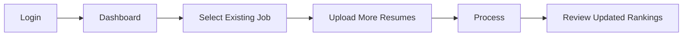
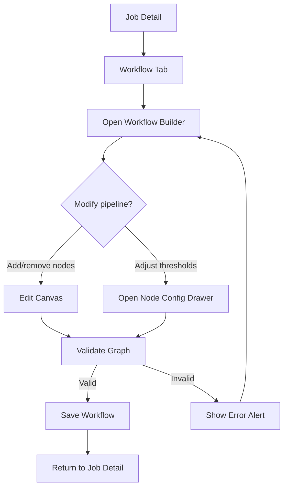
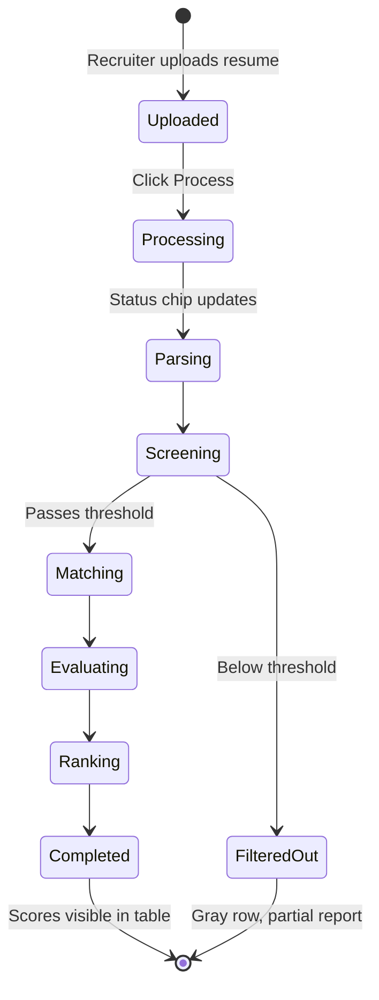

# Frontend Design & Flow

## AI-Based Recruitment Workflow Orchestration Platform

**Purpose:** UI/UX design specification for the recruiter-facing frontend only.  
**Stack:** React + TypeScript + MUI (Material UI) + React Flow  
**Target:** Desktop-first (1280px+), responsive down to tablet

---

## Table of Contents

1. [Design Principles](#1-design-principles)
2. [Visual Design System](#2-visual-design-system)
3. [App Shell & Navigation](#3-app-shell--navigation)
4. [Route Map](#4-route-map)
5. [Screen Designs](#5-screen-designs)
6. [User Flows](#6-user-flows)
7. [Reusable UI Components](#7-reusable-ui-components)
8. [UI States](#8-ui-states)
9. [Screen-to-Screen Journey (Demo Flow)](#9-screen-to-screen-journey-demo-flow)

---

## 1. Design Principles

| Principle | Application |
|-----------|-------------|
| **Clarity over density** | Recruiters scan scores and ranks quickly — use cards, chips, and clear hierarchy |
| **Progressive disclosure** | Summary on list pages; full AI report only on candidate detail |
| **Workflow visibility** | Always show where a candidate is in the pipeline (stepper / status chip) |
| **Action-oriented** | Primary actions (Create Job, Upload, Process) are always visible |
| **Consistent shell** | Same AppBar + sidebar on every authenticated page |
| **AI as assistant** | AI outputs are labeled, structured, and never replace recruiter decision UI |

---

## 2. Visual Design System

### 2.1 Color Palette

**Theme:** Elegant yellow & black — supports **dark** and **light** modes (toggle top-right).

#### Dark mode
| Token | Hex | Usage |
|-------|-----|-------|
| Gold (Primary) | `#F5C518` | Buttons, links, accents |
| Black | `#0A0A0A` | Page background |
| Black Elevated | `#141414` | Cards, panels |
| Text Primary | `#F5F5F5` | Headings, body |
| Text Secondary | `#A3A3A3` | Labels, captions |

#### Light mode
| Token | Hex | Usage |
|-------|-----|-------|
| Gold (Primary) | `#F5C518` | Buttons, links, accents |
| Cream | `#F7F5EF` | Page background |
| White | `#FFFFFF` | Cards, panels |
| Text Primary | `#0A0A0A` | Headings, body |
| Text Secondary | `#5C5C5C` | Labels, captions |

**Typography pairing:** Playfair Display (headings) + Inter (body).  
**Persistence:** Theme choice saved in `localStorage`; defaults to system preference on first visit.

### 2.2 Typography

| Element | MUI Variant | Weight |
|---------|-------------|--------|
| Page title | `h4` | 600 |
| Section title | `h5` / `h6` | 600 |
| Card title | `subtitle1` | 600 |
| Body | `body1` | 400 |
| Labels / meta | `body2` / `caption` | 400 |
| Score numbers | `h5` | 700 |

**Font:** Roboto (MUI default)

### 2.3 Spacing & Shape

- Base spacing unit: **8px** (MUI default)
- Page padding: **24px** (`p: 3`)
- Card border radius: **12px**
- Button border radius: **8px**
- Elevation: Cards use `elevation={1}`; modals/drawers use `elevation={8}`

### 2.4 Score Color Rules

| Score Range | Chip Color | Label |
|-------------|------------|-------|
| 80 – 100 | `success` | Strong match |
| 60 – 79 | `warning` | Moderate match |
| 0 – 59 | `error` | Weak match |

---

## 3. App Shell & Navigation

Used on **all authenticated pages** after login.

```
┌────────────────────────────────────────────────────────────────────┐
│  AppBar                                                            │
│  [Logo] Recruitment AI          [Notifications?]  [Avatar ▼ Logout]│
├──────────────┬─────────────────────────────────────────────────────┤
│              │                                                     │
│   Drawer     │              Main Content Area                      │
│   (240px)    │              (scrollable)                           │
│              │                                                     │
│  ● Dashboard │                                                     │
│  ● Jobs      │                                                     │
│  ○ Settings  │   (optional / future)                               │
│              │                                                     │
└──────────────┴─────────────────────────────────────────────────────┘
```

### Sidebar Nav Items

| Icon | Label | Route |
|------|-------|-------|
| Dashboard | Dashboard | `/dashboard` |
| Work | Jobs | `/jobs` |

### AppBar Elements

- **Left:** Logo + app name
- **Right:** Recruiter name/avatar dropdown → Profile (optional), Logout

### Unauthenticated Layout

No sidebar. Centered `Paper` card on neutral background for Login and Register.

---

## 4. Route Map

```
/                          → redirect to /dashboard or /login
/login                     → Login page
/register                  → Register page

/dashboard                 → Overview stats + recent jobs
/jobs                      → All jobs list
/jobs/new                  → Create job form
/jobs/:jobId               → Job detail (tabs)
/jobs/:jobId/workflow      → Visual workflow builder
/jobs/:jobId/candidates    → Candidates table for job
/candidates/:candidateId   → Full AI report for one candidate
```

### Navigation Hierarchy

```
Login / Register
       │
       ▼
   Dashboard ──────────────────────────────┐
       │                                    │
       ▼                                    │
    Jobs List ──► Create Job                │
       │                                    │
       ▼                                    │
   Job Detail ◄────────────────────────────┘
       │
       ├── Tab: Overview (JD + extracted requirements)
       ├── Tab: Workflow → opens Workflow Builder
       ├── Tab: Candidates → Candidates List
       └── Tab: Upload Resumes
              │
              ▼
       Candidate Detail (AI Report)
```

---

## 5. Screen Designs

---

### 5.1 Login Page

**Route:** `/login`  
**Goal:** Authenticate recruiter

```
┌─────────────────────────────────────────┐
│                                         │
│         ┌─────────────────────┐         │
│         │      [Logo]         │         │
│         │   Welcome Back      │         │
│         │                     │         │
│         │  Email              │         │
│         │  [____________]     │         │
│         │  Password           │         │
│         │  [____________]     │         │
│         │                     │         │
│         │  [    Login    ]    │         │
│         │                     │         │
│         │  Don't have account?│         │
│         │  Register           │         │
│         └─────────────────────┘         │
│                                         │
└─────────────────────────────────────────┘
```

**Elements:**
- `Paper` centered card (max-width 400px)
- Email + Password `TextField`
- Primary `Button` — Login
- Link to Register
- `Alert` for invalid credentials

---

### 5.2 Register Page

**Route:** `/register`  
**Goal:** Create recruiter account

**Fields:** Name, Email, Password, Confirm Password  
**Actions:** Register button, link back to Login  
**Validation:** Inline field errors below inputs

---

### 5.3 Dashboard

**Route:** `/dashboard`  
**Goal:** At-a-glance overview for recruiter

```
┌──────────────────────────────────────────────────────────────────┐
│  Dashboard                                                       │
├──────────────────────────────────────────────────────────────────┤
│                                                                  │
│  ┌─────────────┐  ┌─────────────┐  ┌─────────────┐              │
│  │ Total Jobs  │  │ Candidates  │  │ Avg Score   │              │
│  │     12      │  │    148      │  │    74%      │              │
│  └─────────────┘  └─────────────┘  └─────────────┘              │
│                                                                  │
│  Recent Jobs                                    [+ Create Job]   │
│  ┌────────────────────────────────────────────────────────────┐  │
│  │ Title          │ Status │ Candidates │ Avg Score │ Action  │  │
│  │ Backend Dev    │ Open   │     24     │   78      │ View →  │  │
│  │ Frontend Dev   │ Open   │     18     │   71      │ View →  │  │
│  │ Data Analyst   │ Closed │     32     │   65      │ View →  │  │
│  └────────────────────────────────────────────────────────────┘  │
│                                                                  │
│  Processing Activity (optional)                                  │
│  ● 3 candidates processing on "Backend Dev"                      │
│                                                                  │
└──────────────────────────────────────────────────────────────────┘
```

**Sections:**
1. **Stat cards** — 3 KPI cards in a row
2. **Recent jobs table** — quick access to active jobs
3. **FAB or header button** — Create Job

**Actions:**
- Click job row → Job Detail
- Create Job → `/jobs/new`

---

### 5.4 Jobs List

**Route:** `/jobs`  
**Goal:** Manage all job openings

```
┌──────────────────────────────────────────────────────────────────┐
│  Jobs                                    [+ Create Job]          │
├──────────────────────────────────────────────────────────────────┤
│  [Search...]  [Status: All ▼]                                    │
│                                                                  │
│  ┌────────────────────────────────────────────────────────────┐│
│  │ Title        │ Location │ Status  │ Candidates │ Created   ││
│  │ Backend Dev  │ Remote   │ ● Open  │    24      │ Sep 1     ││
│  │ UI Designer  │ Mumbai   │ ● Draft │     0      │ Sep 3     ││
│  └────────────────────────────────────────────────────────────┘│
│                                                                  │
└──────────────────────────────────────────────────────────────────┘
```

**Table columns:** Title, Location, Status (Chip), Candidate count, Created date, Actions (View, Edit, Delete)

**Status chips:**
- Draft — `default`
- Open — `success`
- Closed — `error`

---

### 5.5 Create / Edit Job

**Route:** `/jobs/new` or `/jobs/:jobId/edit`  
**Goal:** Define job opening and trigger JD processing

```
┌──────────────────────────────────────────────────────────────────┐
│  ← Back          Create Job Opening                              │
├──────────────────────────────────────────────────────────────────┤
│                                                                  │
│  Job Title *          [________________________]                 │
│  Location             [________________________]                 │
│  Experience (years)   [ Min ___ ]  [ Max ___ ]                 │
│  Status               [ Draft ▼ ]                                │
│                                                                  │
│  Job Description *                                               │
│  ┌────────────────────────────────────────────────────────────┐  │
│  │ Paste full job description here...                         │  │
│  │                                                            │  │
│  └────────────────────────────────────────────────────────────┘  │
│                                                                  │
│                        [Cancel]  [Save Job]                      │
│                                                                  │
└──────────────────────────────────────────────────────────────────┘
```

**After save:** Redirect to Job Detail → Overview tab shows extracted requirements (loading skeleton while AI processes)

---

### 5.6 Job Detail

**Route:** `/jobs/:jobId`  
**Goal:** Central hub for one job — requirements, workflow, candidates, upload

```
┌──────────────────────────────────────────────────────────────────┐
│  Backend Developer                          Status: [Open ▼]     │
│  Remote · 2–5 yrs experience                                     │
├──────────────────────────────────────────────────────────────────┤
│  [ Overview ] [ Workflow ] [ Candidates ] [ Upload ]             │
├──────────────────────────────────────────────────────────────────┤
│                                                                  │
│  (Tab content below)                                             │
│                                                                  │
└──────────────────────────────────────────────────────────────────┘
```

#### Tab 1: Overview

Shows:
- Full job description (read-only or editable)
- **Extracted Requirements** card (AI output):
  - Required skills (Chips)
  - Preferred skills (Chips)
  - Min experience, education
  - Key responsibilities (List)
- Button: **Re-process JD** (if JD was edited)

```
┌─ Extracted Requirements ──────────────────────────────────────┐
│  Required Skills   [Python] [FastAPI] [PostgreSQL]            │
│  Preferred Skills  [Docker] [AWS]                             │
│  Experience        2+ years                                   │
│  Education         B.Tech / MCA                               │
└───────────────────────────────────────────────────────────────┘
```

#### Tab 2: Workflow

- Embedded preview of current workflow pipeline
- Button: **Open Workflow Builder** → `/jobs/:jobId/workflow`

#### Tab 3: Candidates

- Embedded candidates table (same as 5.8) or link to full page

#### Tab 4: Upload

- Drag-and-drop upload zone
- File list with upload progress
- Button: **Start Processing** (triggers pipeline)

---

### 5.7 Workflow Builder

**Route:** `/jobs/:jobId/workflow`  
**Goal:** Visually configure recruitment pipeline stages

```
┌──────────────────────────────────────────────────────────────────────────┐
│  ← Job Detail     Workflow Builder                    [Save Workflow]  │
├──────────────┬───────────────────────────────────────────────────────────┤
│              │                                                           │
│  Node        │     Canvas (React Flow)                                   │
│  Palette     │                                                           │
│              │   ┌────────┐    ┌────────┐    ┌────────┐    ┌────────┐   │
│  [Parse]     │   │ Parse  │───►│ Screen │───►│ Match  │───►│ Evaluate│  │
│  [Screen]    │   └────────┘    └────────┘    └────────┘    └────┬───┘   │
│  [Match]     │                                                    │       │
│  [Evaluate]  │                              ┌────────┐    ┌──────▼───┐   │
│  [Rank]      │                              │Interview│◄───│  Rank   │   │
│  [Interview] │                              └────────┘    └─────────┘   │
│              │                                                           │
└──────────────┴───────────────────────────────────────────────────────────┘
                                                      ┌─────────────────────┐
                                                      │ Config Drawer       │
                                                      │ (opens on node click│
                                                      │  Screen threshold:  │
                                                      │  [====●=====] 60    │
                                                      └─────────────────────┘
```

**Node colors:**

| Node | Color | Icon idea |
|------|-------|-----------|
| Parse | Blue `#1565C0` | Document |
| Screen | Amber `#FFA000` | Filter |
| Skill Match | Green `#2E7D32` | Compare |
| Evaluate | Purple `#6A1B9A` | Assessment |
| Rank | Orange `#ED6C02` | Leaderboard |
| Interview | Teal `#00838F` | Question |

**Interactions:**
- Drag node from palette → canvas
- Connect nodes with edges (arrow direction = execution order)
- Click node → right `Drawer` with config sliders/fields
- Save → Snackbar "Workflow saved"
- Invalid graph → `Alert` (e.g., cycle detected, missing parse node)

**Config drawer fields by node:**

| Node | Fields |
|------|--------|
| Parse | None (required, fixed) |
| Screen | Threshold slider (0–100) |
| Skill Match | Required weight, Preferred weight |
| Evaluate | Skills / Experience / Education / Projects weights |
| Rank | Screening / Match / Evaluation weights |
| Interview | # technical, # behavioral, # gap questions |

---

### 5.8 Candidates List

**Route:** `/jobs/:jobId/candidates`  
**Goal:** View all applicants with scores, rank, and pipeline status

```
┌──────────────────────────────────────────────────────────────────┐
│  Backend Developer — Candidates          [Upload] [Process All]  │
├──────────────────────────────────────────────────────────────────┤
│  [Search name...]  [Status ▼]  [Sort: Rank ▼]                  │
│                                                                  │
│  ┌────────────────────────────────────────────────────────────┐│
│  │Rank│ Name       │ Match │ Eval │ Overall │ Status  │ Action││
│  │ 1  │ John Doe   │  88   │  85  │  86.5   │ ● Done  │ View  ││
│  │ 2  │ Jane Smith │  82   │  80  │  81.0   │ ● Done  │ View  ││
│  │ 3  │ Bob Lee    │  45   │  —   │  —      │ ○ Filtered│ View ││
│  │ —  │ Alice Chen │  —    │  —   │  —      │ ⟳ Parsing│ View  ││
│  └────────────────────────────────────────────────────────────┘│
│                                                                  │
└──────────────────────────────────────────────────────────────────┘
```

**Columns:** Rank, Name, Match Score, Eval Score, Overall Score, Status, Actions

**Status chips:**

| Status | Chip | Meaning |
|--------|------|---------|
| pending | `default` | Queued |
| parsing / screening / ... | `warning` + spinner | In progress |
| completed | `success` | Pipeline done |
| filtered_out | `default` | Failed screening |
| failed | `error` | Agent error |

**Row click or View** → Candidate Detail

---

### 5.9 Candidate Detail (AI Report)

**Route:** `/candidates/:candidateId`  
**Goal:** Full AI-generated insights for recruiter decision support

```
┌──────────────────────────────────────────────────────────────────┐
│  ← Back to Candidates                                            │
│                                                                  │
│  John Doe                              Rank #1  [Score: 86.5]    │
│  john@email.com · 3 yrs exp                                      │
├──────────────────────────────────────────────────────────────────┤
│                                                                  │
│  Pipeline Progress                                               │
│  [Parse ✓] → [Screen ✓] → [Match ✓] → [Eval ✓] → [Rank ✓] → [Int ✓]│
│                                                                  │
├──────────────────────────────────────────────────────────────────┤
│                                                                  │
│  ┌─ Parsed Profile ──────────────────────────────────────────┐  │
│  │ Skills: [Python] [FastAPI] [React]                        │  │
│  │ Education: MCA · Experience: 3 years                      │  │
│  └───────────────────────────────────────────────────────────┘  │
│                                                                  │
│  ┌─ Screening ────────────────────────────── Score: 82 ──────┐  │
│  │ Relevant: Yes                                               │  │
│  │ "Strong Python backend experience matches role requirements"│  │
│  └───────────────────────────────────────────────────────────┘  │
│                                                                  │
│  ┌─ Skill Match ──────────────────────────── Score: 88 ──────┐  │
│  │ Matched: Python, FastAPI, PostgreSQL                        │  │
│  │ Missing: Docker (preferred)                                 │  │
│  └───────────────────────────────────────────────────────────┘  │
│                                                                  │
│  ┌─ Evaluation ───────────────────────────── Score: 85 ──────┐  │
│  │ Recommendation: [Shortlist]                                 │  │
│  │ Strengths: ...    Weaknesses: ...                           │  │
│  └───────────────────────────────────────────────────────────┘  │
│                                                                  │
│  ┌─ Interview Questions ──────────────────────────────────────┐  │
│  │ [Technical] [Behavioral] [Gap Probing]                      │  │
│  │ 1. Explain FastAPI dependency injection...                  │  │
│  │ 2. How do you design RESTful APIs?                          │  │
│  └───────────────────────────────────────────────────────────┘  │
│                                                                  │
│  [Download Report]  (optional future)                          │
│                                                                  │
└──────────────────────────────────────────────────────────────────┘
```

**Layout:** Vertical stack of `Accordion` or `Card` sections — one per agent stage.

**Interview section:** MUI `Tabs` for Technical / Behavioral / Gap Probing question lists.

---

## 6. User Flows

### 6.1 First-Time Recruiter Flow

```mermaid
flowchart LR
    A[Register] --> B[Login]
    B --> C[Dashboard]
    C --> D[Create Job]
    D --> E[Job Detail - Overview]
    E --> F[View Extracted Requirements]
    F --> G[Open Workflow Builder]
    G --> H[Save Default Workflow]
    H --> I[Upload Tab - Add Resumes]
    I --> J[Start Processing]
    J --> K[Candidates Tab - View Rankings]
    K --> L[Candidate Detail - AI Report]
```



### 6.2 Return Recruiter Flow



### 6.3 Workflow Configuration Flow



### 6.4 Candidate Processing Flow (UI perspective)



---

## 7. Reusable UI Components

| Component | Used On | Description |
|-----------|---------|-------------|
| `AppLayout` | All auth pages | AppBar + Drawer + content area |
| `StatCard` | Dashboard | Icon + number + label |
| `JobCard` | Dashboard, Jobs list | Compact job summary |
| `StatusChip` | Jobs, Candidates | Draft/Open/Closed, pipeline status |
| `ScoreBadge` | Candidates table, detail | Colored chip with numeric score |
| `StageProgress` | Candidate detail | Horizontal stepper for pipeline |
| `SkillChips` | Job overview, candidate profile | Green = matched, gray = missing |
| `RequirementCard` | Job overview | Extracted JD requirements |
| `EvaluationCard` | Candidate detail | Strengths, weaknesses, recommendation |
| `InterviewTabs` | Candidate detail | Tabbed question lists |
| `UploadZone` | Job upload tab | Drag-drop + file list |
| `WorkflowCanvas` | Workflow builder | React Flow canvas |
| `NodePalette` | Workflow builder | Draggable agent nodes |
| `NodeConfigDrawer` | Workflow builder | Right drawer for node settings |
| `EmptyState` | Any list with no data | Illustration + CTA button |

---

## 8. UI States

Every data-driven screen must handle these states:

| State | Visual Treatment |
|-------|------------------|
| **Loading** | MUI `Skeleton` for cards/tables; `CircularProgress` for actions |
| **Empty** | Centered message + primary CTA (e.g., "No jobs yet — Create your first job") |
| **Error** | MUI `Alert` severity="error" with retry button |
| **Success** | MUI `Snackbar` for save/upload/process confirmations |
| **Processing** | `LinearProgress` on upload tab; status chips with spinner on candidate rows |
| **Partial data** | Filtered-out candidates show completed stages only; later sections hidden |

---

## 9. Screen-to-Screen Journey (Demo Flow)

Use this sequence for viva demo and design review:

| Step | Screen | User Action | What to Show |
|------|--------|-------------|--------------|
| 1 | Login | Enter credentials | Clean auth card |
| 2 | Dashboard | View stats | KPI cards + recent jobs |
| 3 | Create Job | Fill form + paste JD | Form validation |
| 4 | Job Detail → Overview | Wait / refresh | Extracted skills appear as chips |
| 5 | Job Detail → Workflow | Click "Open Builder" | Visual pipeline graph |
| 6 | Workflow Builder | Show default pipeline | Connected nodes left-to-right |
| 7 | Job Detail → Upload | Drop 3–5 PDFs | Upload progress bars |
| 8 | Job Detail → Upload | Click "Process" | Snackbar confirmation |
| 9 | Candidates List | Poll / refresh | Scores populate, ranks assigned |
| 10 | Candidate Detail | Click rank #1 | Full AI report with all sections |
| 11 | Candidate Detail | Switch interview tabs | Generated questions per category |

---

## Summary: Pages to Build

| # | Page | Priority |
|---|------|----------|
| 1 | Login | Must |
| 2 | Register | Must |
| 3 | Dashboard | Must |
| 4 | Jobs List | Must |
| 5 | Create Job | Must |
| 6 | Job Detail (4 tabs) | Must |
| 7 | Workflow Builder | Must |
| 8 | Candidates List | Must |
| 9 | Candidate Detail | Must |

**Total: 9 pages / views** — sufficient for a complete MCA frontend demo.

---

*Design reference only. Backend integration comes after UI is approved.*
